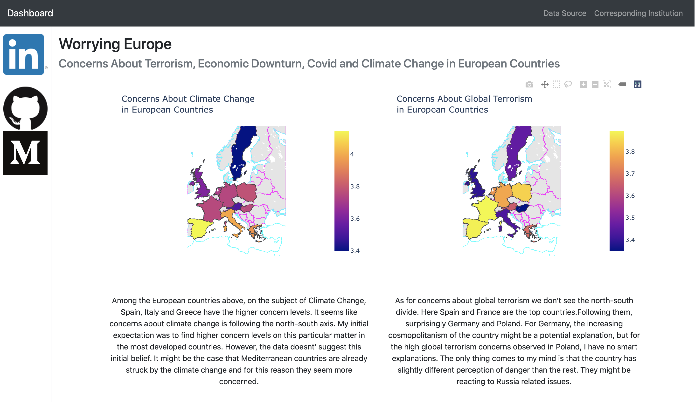

<h1>Worrying Europe</h1>

This repository contains code for the data dashboard that I have pushed online using **heroku**.

The dashboard is *available at* https://worrying-europe.herokuapp.com

I have used the dataset **Everyday Life in Germany and Europe 2020 (Solikris)** that is publicly available at **GESIS** 
archive

Dashboard contains visualisations of general concern levels about
> Climate Change
>
> Global Terrorism.
> 
> Covid 19
> 
> Economic Downturn

